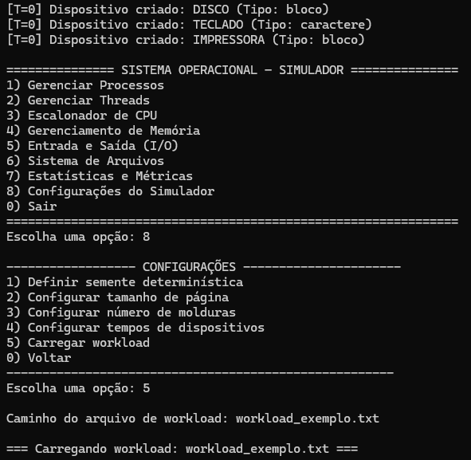
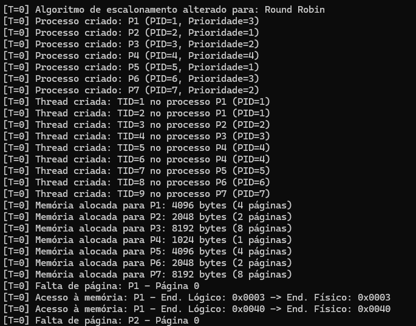
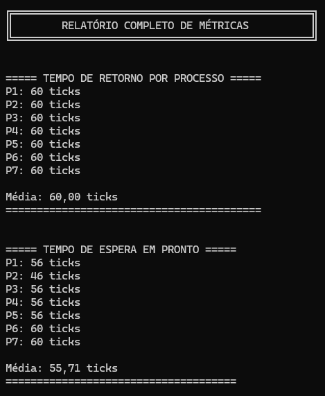
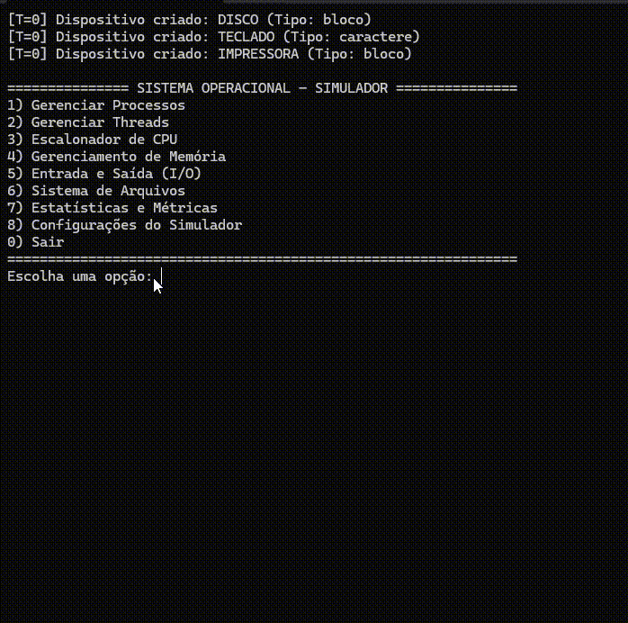
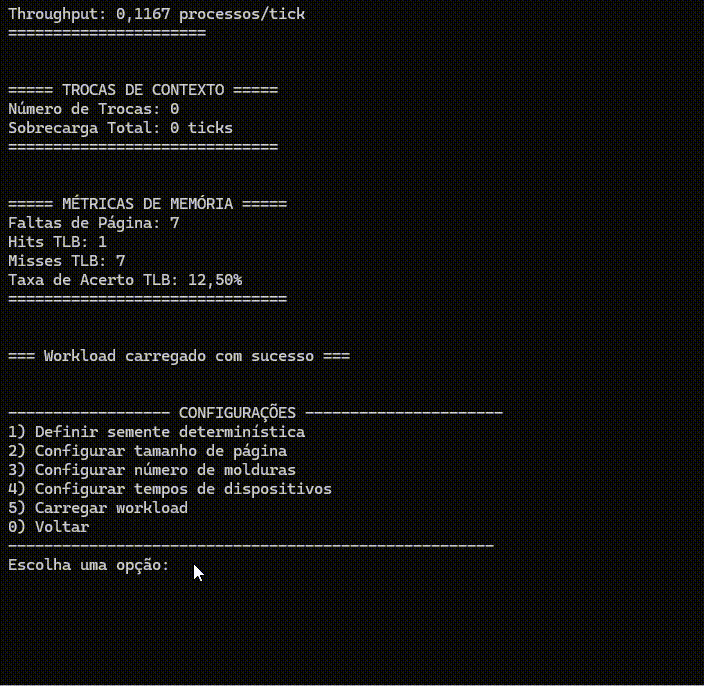
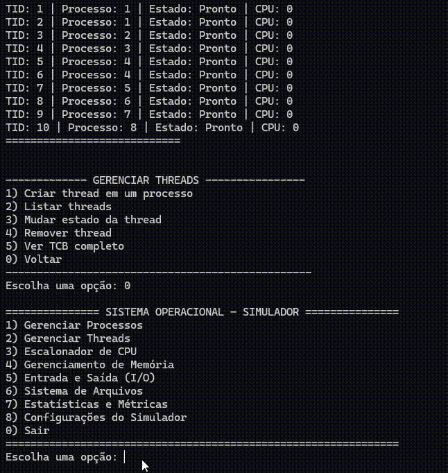

# Simulador SO- Versão Console

Este projeto é um **simulador completo de Sistema Operacional**, desenvolvido em **C# (versão console)**, com o objetivo de reproduzir os principais componentes internos de um SO real, como gerenciamento de processos, threads, memória, escalonamento, E/S, sistema de arquivos e métricas.

A estrutura do projeto é totalmente modular, permitindo fácil compreensão e expansão do simulador.

---

## 🧩 Estrutura Geral do Projeto

A solução é dividida em **10 módulos principais**, cada um representando um subsistema fundamental do Sistema Operacional.

---

## ✅ 1. Núcleo 
Parte central do simulador — o “motor” do SO.

Arquivos:
- `Kernel.cs`
- `Relogio.cs`
- `RegistradorDeEventos.cs`
- `Configuracoes.cs`
- `CarregadorWorkload.cs`

---

## ✅ 2. Processos 
Gerenciamento de processos.

Arquivos:
- `Processo.cs`
- `PCB.cs`
- `EstadoProcesso.cs`
- `GerenciadorDeProcessos.cs`

---

## ✅ 3. Threads 
Subsistema de gerenciamento de threads.

Arquivos:
- `ThreadSimulada.cs`
- `TCB.cs`
- `EstadoThread.cs`
- `GerenciadorDeThreads.cs`

---

## ✅ 4. Escalonamento 
Algoritmos de escalonamento de CPU.

Arquivos:
- `IAlgoritmoEscalonamento.cs`
- `FCFS.cs`
- `RoundRobin.cs`
- `PrioridadePreemptivo.cs`
- `PrioridadeNaoPreemptivo.cs`
- `FilaProntos.cs`
- `Escalonador.cs`
- `TrocaDeContexto.cs`

---

## ✅ 5. Memória 
Modelo de memória virtual e física.

Arquivos:
- `GerenciadorDeMemoria.cs`
- `Pagina.cs`
- `TabelaDePaginas.cs`
- `Moldura.cs`
- `TabelaDeMolduras.cs`
- `PoliticaAlocacao.cs`
- `EntradaTLB.cs`
- `TLB.cs`

---

## ✅ 6. Entrada e Saída 
Simulação de dispositivos e operações de E/S.

Arquivos:
- `IDispositivo.cs`
- `DispositivoDeBloco.cs`
- `DispositivoDeCaractere.cs`
- `RequisicaoES.cs`
- `GerenciadorES.cs`
- `Interrupcao.cs`

---

## ✅ 7. Sistema de Arquivos 
Mini File System simulado.

Arquivos:
- `SistemaDeArquivos.cs`
- `INode.cs` ou `FCB.cs`
- `EntradaArquivo.cs`
- `EntradaDiretorio.cs`
- `ManipuladorArquivo.cs`
- `TabelaDeAlocacao.cs`
- `CacheDeBlocos.cs` *

---

## ✅ 8. Métricas 
Sistema de coleta e registro de métricas do SO.

Arquivos:
- `GerenciadorDeMetricas.cs`
- `MetricasProcesso.cs`
- `MetricasDispositivo.cs`
- `MetricasMemoria.cs`

---

## ✅ 9. Interface (Menus) 
Menus de interação pelo console.

Arquivos:
- `MenuPrincipal.cs`
- `MenuProcessos.cs`
- `MenuThreads.cs`
- `MenuEscalonamento.cs`
- `MenuMemoria.cs`
- `MenuES.cs`
- `MenuArquivo.cs`
- `MenuMetricas.cs`
- `MenuConfiguracoes.cs`

---

## ✅ 10. Utilitários 
Funções auxiliares.

Arquivos:
- `GeradorIDs.cs`
- `GeradorAleatorio.cs`

---
## 📷 Imagens da Aplicação

A pasta simulador contém **3 imagens** e **3 GIFs** demonstrando a execução e as telas do simulador. 

  
*Figura 1 — Carregando o arquivo texto.*

  
*Figura 2 — Como o simulador analisa o arquivo texto.*

  
*Figura 3 — Relatório gerado pelo arquivo texto.*

### Animações (GIFs)
  
*GIF 1 — Carregando o arquivo texto.*

  
*GIF 2 — Adicionando e gerenciando um novo processo.*

  
*GIF 3 — Criando e gerenciando uma nova thread.*

---
## 🎯 Objetivo do Projeto

Este simulador foi desenvolvido com os seguintes objetivos:

- Demonstrar de forma didática como funciona o interior de um Sistema Operacional.
- Implementar uma arquitetura modular semelhante a sistemas reais.
- Permitir experimentação e estudos de algoritmos de escalonamento, memória e E/S.
- Facilitar o aprendizado através de menus e simulação interativa.

---

## ▶️ Como Executar

1. Clone o repositório:
```bash
git clone https://github.com/CarolineGrizante/SimuladorSO
